# 🎨 Sketch2Shape

Sketch2Shape is a modern web-based sketching application that allows users to draw freehand sketches, detect geometric shapes, and save their work securely in the cloud. It provides a clean, responsive interface with authentication, dark mode, and an interactive dashboard for managing drawings.


---

## ✨ Features

### 🖊️ Drawing Canvas
- Freehand drawing
- Brush color selection
- Smooth canvas rendering
- Clear canvas
- Undo functionality
- Redo functionality

### 🔷 Shape Detection
- Detects hand-drawn shapes
- Converts rough sketches into clean geometric shapes
- Supports:
  - Circle
  - Line

### 💾 Cloud Storage
- Save drawings to MongoDB
- Store preview images on Cloudinary
- Automatic thumbnail generation
- Load previously saved sketches
- Delete saved drawings

### 👤 Authentication
- User registration
- Secure login
- JWT authentication
- Protected routes
- Individual drawing collections

### 📂 Dashboard
- View all saved sketches
- Preview thumbnails
- Open drawings
- Delete drawings
- Responsive card layout

### 🎨 User Experience
- Light/Dark mode
- Responsive design
- Modern UI
- Radix UI dialogs
- Toast notifications
- Keyboard-friendly interface

---

# 🛠️ Tech Stack

## Frontend

- React
- React Konva
- Vite
- Axios
- Radix UI
- React Hot Toast
- React Icons
- CSS3

## Backend

- Node.js
- Express.js
- MongoDB
- Mongoose
- JWT
- Cloudinary

---

# 📁 Project Structure

```
Sketch2Shape
│
├── frontend
│   ├── components
│   ├── hooks
│   ├── styles
│   ├── utils
│   ├── pages
│   └── services
│
├── backend
│   ├── config
│   ├── middleware
│   ├── models
│   ├── routes
│   ├── utils
│   └── server.js
│
└── README.md
```

---

# 📸 Screenshots

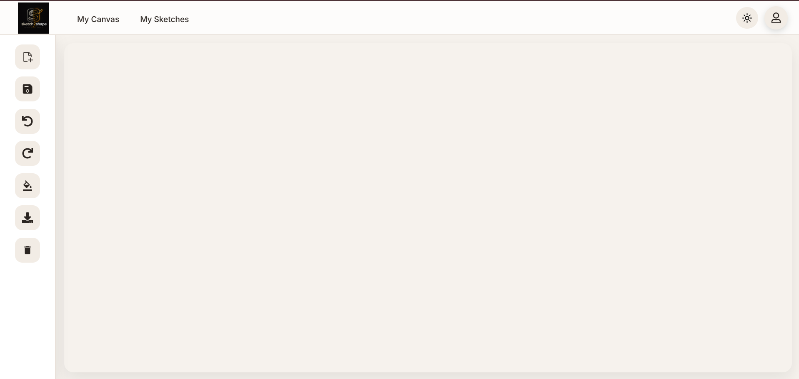
Main Canvas of the Sketch App

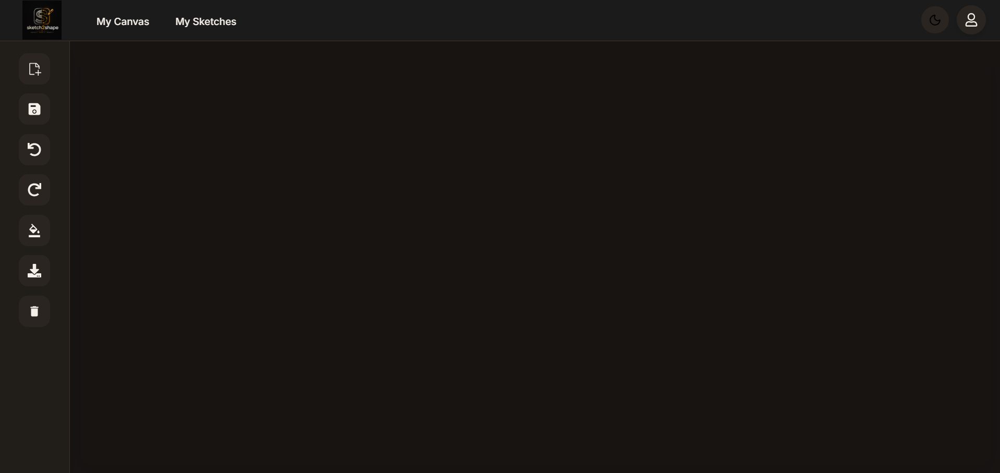
Main Canvas of the Sketch App in Dark Mode

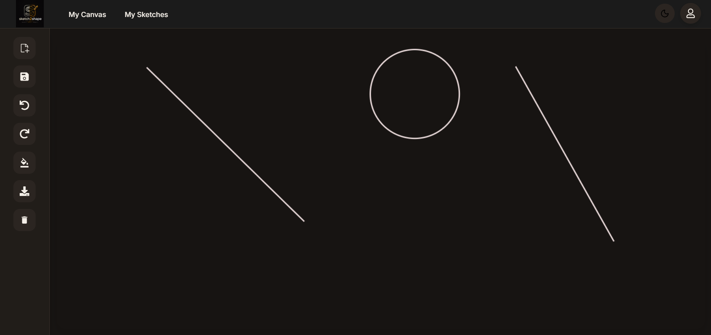
Drawing on The Canvas

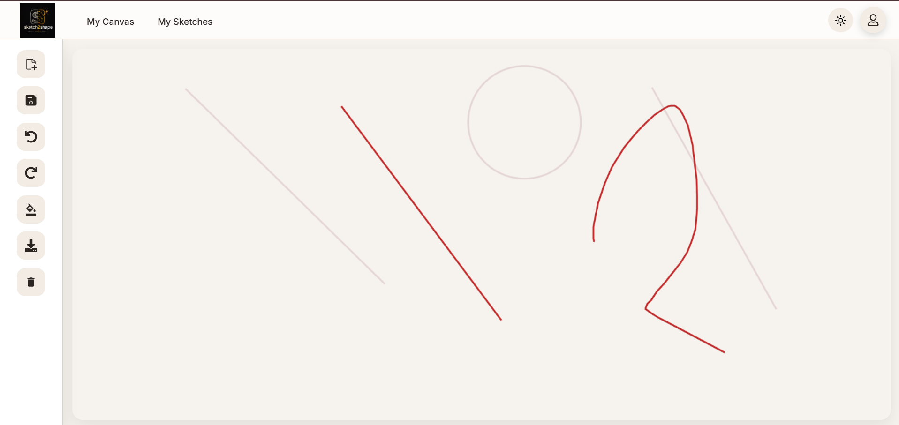
Drawing on The Canvas

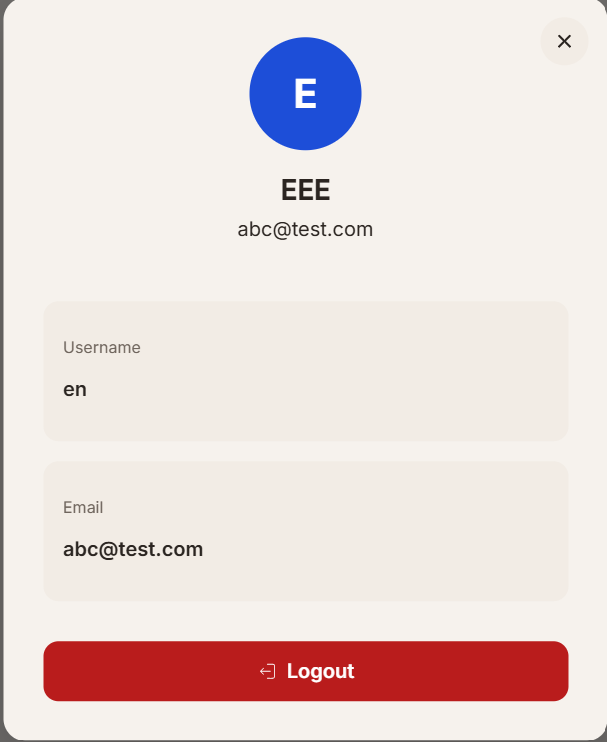
Profile of the User

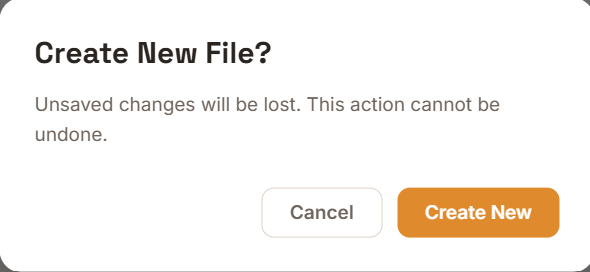
New File creation option

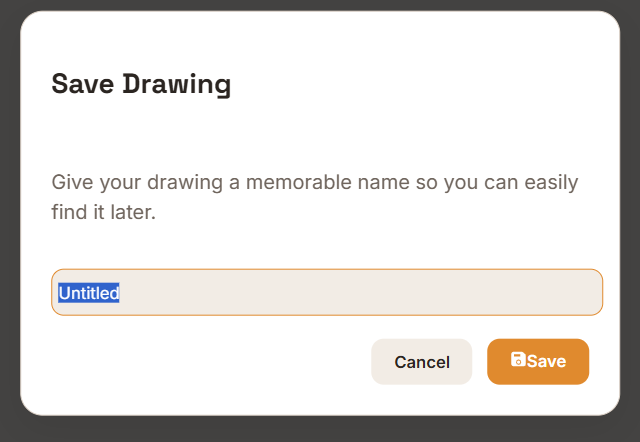
Save File option

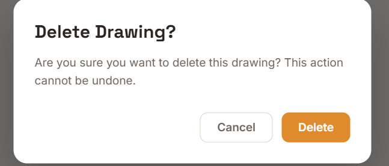
Delete Drawing option

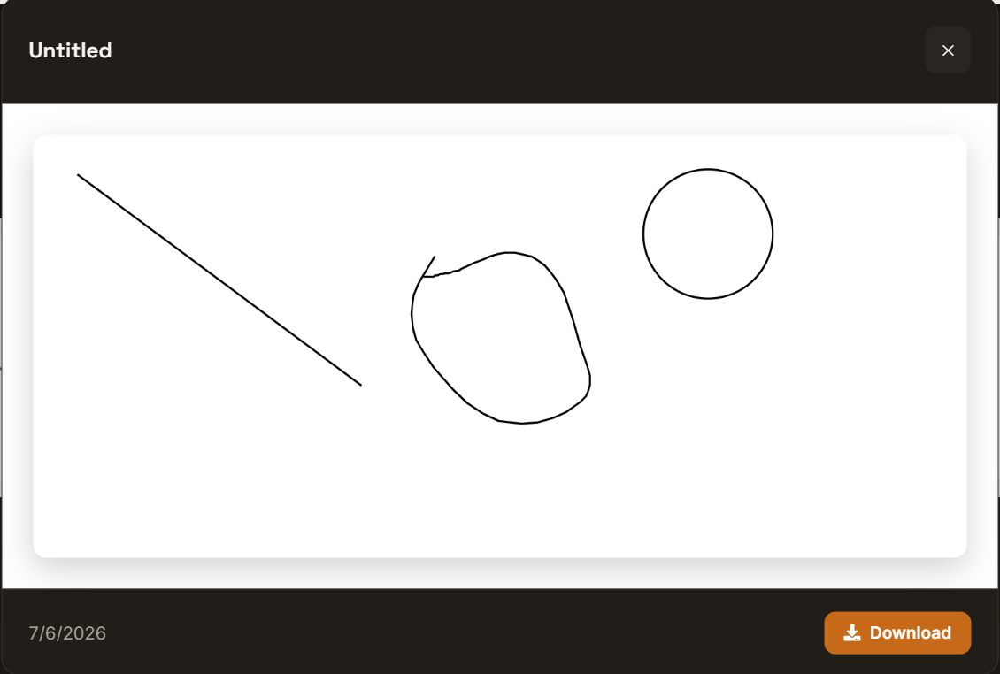
Drawing Preview after saving.

## Home & Drawing Canvas


Home Page

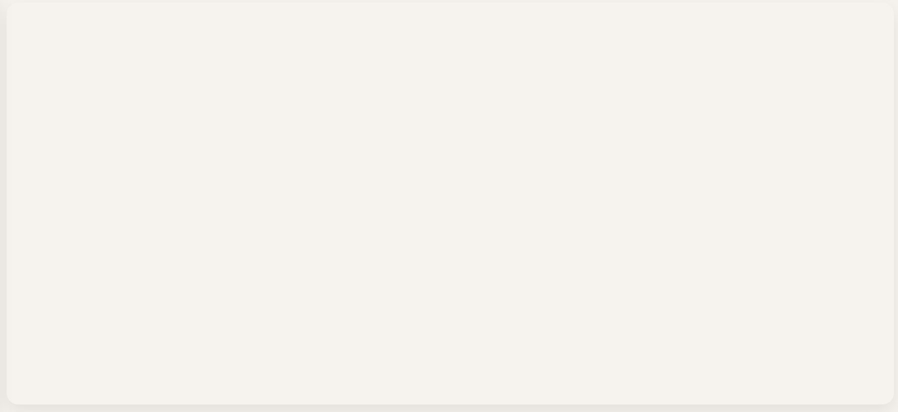
Canvas


## Dashboard

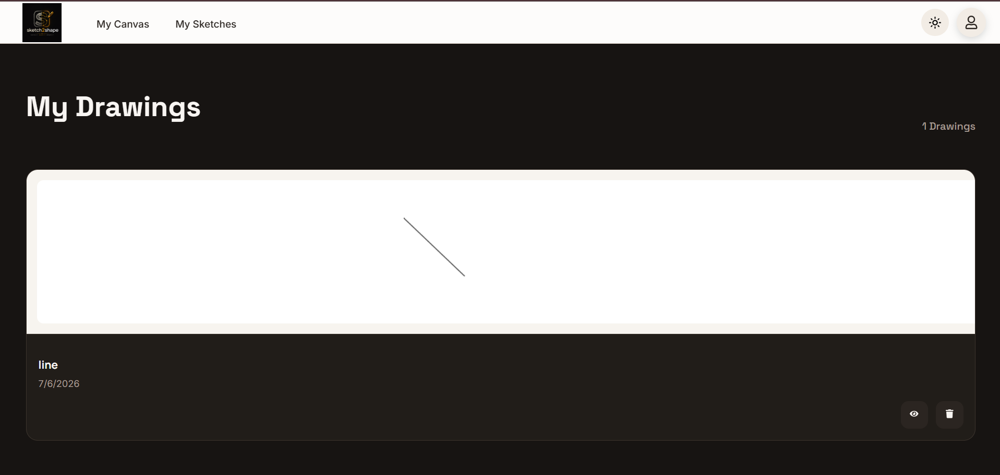

## Dark Mode


---

# 🚀 Installation

## Clone Repository

```bash
git clone https://github.com/yourusername/sketch2shape.git

cd sketch-app
```

---

## Install Frontend

```bash
cd frontend

npm install
```

---

## Install Backend

```bash
cd backend

npm install
```

---

# ⚙️ Environment Variables

Create a `.env` file inside the backend.

```env
PORT=5000

MONGO_URI=your_mongodb_connection_string

JWT_SECRET=your_secret_key

CLOUDINARY_CLOUD_NAME=your_cloud_name

CLOUDINARY_API_KEY=your_api_key

CLOUDINARY_API_SECRET=your_api_secret
```

---

# ▶️ Running the Project

## Backend

```bash
npm run dev
```

## Frontend

```bash
npm run dev
```

The application will be available at

```
http://localhost:5173
```

---

# API Endpoints

## Authentication

| Method | Endpoint | Description |
|----------|----------|-------------|
| POST | `/auth/signup` | Register user |
| POST | `/auth/login` | Login user |
| GET | `/api/me` | Get current user |

---

## Drawings

| Method | Endpoint | Description |
|----------|----------|-------------|
| POST | `/api/save` | Save drawing |
| GET | `/api/dashboard` | Get all drawings |
| DELETE | `/api/delete/:id` | Delete drawing |

---

# Security

- Password hashing
- JWT authentication
- Protected API routes
- User-specific drawing storage
- Cloud image hosting
- Environment variable protection

---

# Future Improvements

- Multi-layer canvas
- AI-assisted sketch enhancement
- Export as SVG
- Export as PDF
- Collaborative drawing
- Version history
- Shape editing
- Keyboard shortcuts
- Drawing sharing
- Real-time collaboration

---

# Performance

- Optimized image loading
- Thumbnail previews
- Lazy rendering
- Responsive UI
- Efficient canvas updates

---

# Contributing

Contributions are welcome.

1. Fork the repository.
2. Create a feature branch.
3. Commit your changes.
4. Push to your branch.
5. Open a Pull Request.

---

# License

This project is licensed under the MIT License.

---

# Author

**Rajgaurav Patil**

GitHub: https://github.com/raj-programs

LinkedIn: www.linkedin.com/in/rajgaurav-patil

---

⭐ If you found this project helpful, consider giving it a star!